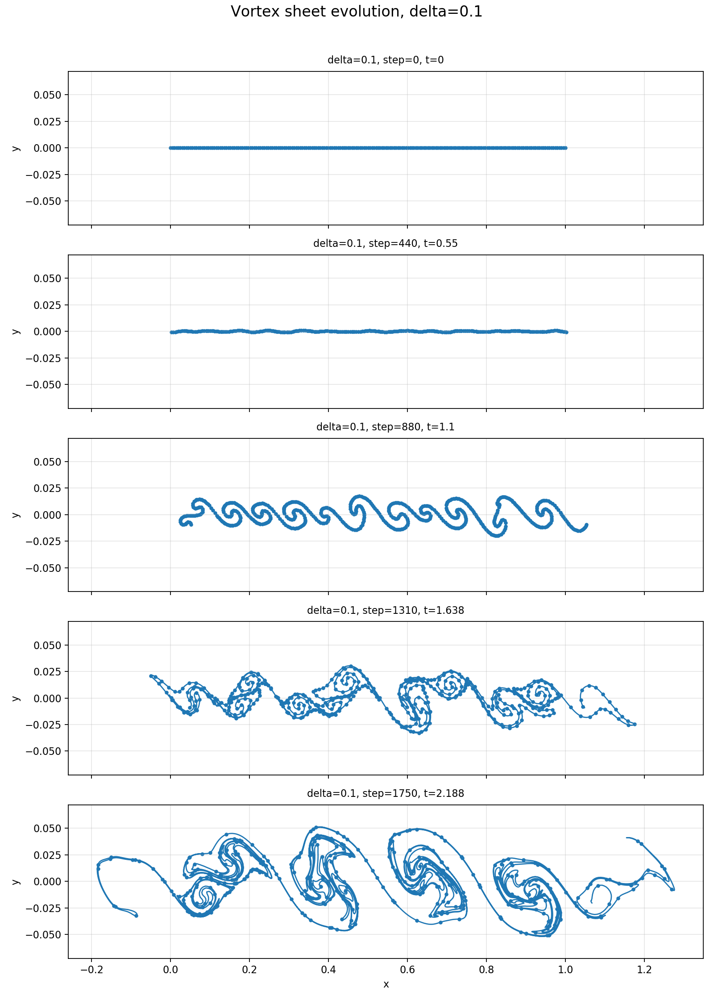
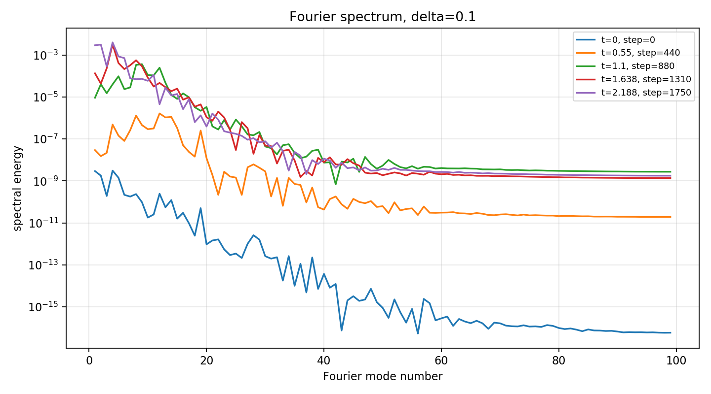
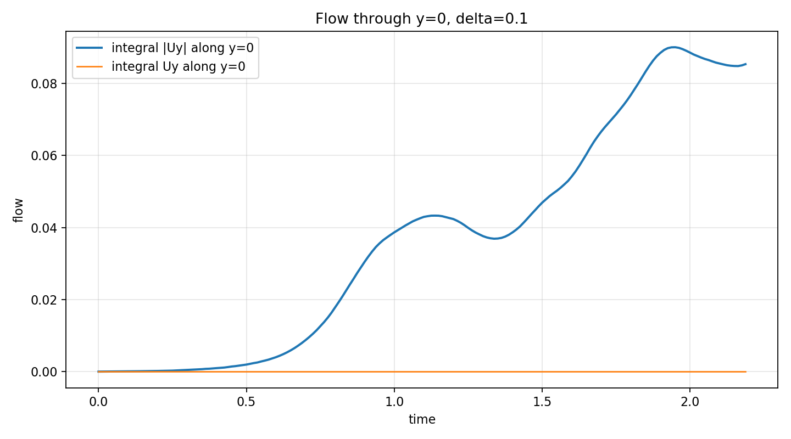
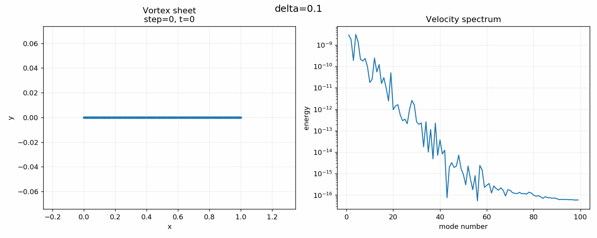

# MPI Vortex Sheet Simulation

Numerical simulation of the Kelvin-Helmholtz instability using the vortex sheet method, fourth-order Runge-Kutta time integration, and parallel MPI computations.

The project focuses on the numerical investigation of an instability developing at the interface between two fluid layers moving with different velocities. In such a system, shear at the interface leads to the growth of perturbations, vortex sheet roll-up, and the formation of vortex structures.

In this project, the vortex sheet is represented by discrete vortex points. Each point moves with the velocity induced by all the remaining points. After discretization, the problem has the character of an N-body problem, because every element interacts with every other element.

---

## Project Goal

The goal of the project was to reproduce and extend earlier numerical results available in the literature on the Kelvin-Helmholtz instability, using modern computers, parallel computation, and increased numerical precision.

In particular, the project investigates:

- spatial evolution of the vortex sheet,
- influence of the regularization parameter `delta` on the development of vortex structures,
- Fourier spectrum of the induced velocity,
- flow through the surface `y=0`,
- comparison of results for different initial perturbations,
- influence of numerical precision on stability and quality of the results.

The main difference compared with earlier results was the use of `double` precision instead of `float`, together with parallel computation. This made it possible to extend the simulation time, reduce the discretization scale, and study the development of vortex structures more accurately in comparison with earlier numerical works.

Additionally, compared with the basic approach, the project studies not only the time evolution of the vortex sheet, but also its Fourier spectrum and the flow through the initial separation surface.

---

## Physical Background

The Kelvin-Helmholtz instability appears at the interface between two fluid layers moving with different velocities. A small perturbation of the interface can be amplified by the velocity field induced by the vortex sheet itself. As a result, the sheet begins to roll up and form characteristic vortex structures.

The following assumptions are used in the model:

- no viscosity,
- no surface tension,
- conservation of circulation,
- periodic boundary conditions,
- sinusoidal or random initial perturbation,
- regularization of small scales by the parameter `delta`.

The implementation allows switching between two initial perturbation modes:

- `noise` — uniformly distributed random perturbation,
- `sin` — sinusoidal perturbation.

In an inviscid model, the vortex sheet may develop very small-scale structures. Since resolving arbitrarily small scales is impossible numerically, regularization is introduced to make the problem computationally tractable.

---

## Numerical Model

The vortex sheet is represented by a set of discrete vortex points:

```cpp
struct wir {
    double x;
    double y;
    double epsilon;
    double gamma;
};
```

where:

- `x`, `y` denote the position of a vortex point,
- `epsilon` is the coordinate parametrizing the vortex sheet,
- `gamma` is the circulation density.

The total circulation is computed from the velocity jump across the sheet:

```math
G = u_1 L - u_2 L = (u_1-u_2)L
```

where:

- `L` is the initial length of the sheet,
- `u1` is the velocity on one side of the sheet,
- `u2` is the velocity on the other side of the sheet.

The circulation density is then assigned along the parametrized sheet. After discretization, each vortex point is advected by the velocity field induced by all other points.

After discretization, the problem becomes an N-body type problem, because every vortex point interacts with all other vortex points. For a direct summation method, this gives computational complexity of approximately:

```math
\mathcal{O}(N^2)
```

where `N` is the number of vortex points.

---

## Dynamical Equations

For a vortex point located at `(x_i, y_i)`, the regularized periodic velocity induced by another vortex point `(x_j, y_j)` is computed using the denominator:

```math
D_{ij}
=
\cosh\left(2\pi(y_i-y_j)\right)
-
\cos\left(2\pi(x_i-x_j)\right)
+
\delta^2
```

The induced horizontal velocity contribution is:

```math
u_{x,ij}
=
-\frac{1}{2}
\gamma_j
\frac{
\sinh\left(2\pi(y_i-y_j)\right)
}{
D_{ij}
}
```

The induced vertical velocity contribution is:

```math
u_{y,ij}
=
\frac{1}{2}
\gamma_j
\frac{
\sin\left(2\pi(x_i-x_j)\right)
}{
D_{ij}
}
```

The full velocity of point `i` is obtained by summing contributions from the discretized vortex sheet:

```math
\frac{dx_i}{dt}
\approx
\sum_{j=1}^{N-1}
u_{x,ij}\Delta \epsilon_j
```

```math
\frac{dy_i}{dt}
\approx
\sum_{j=1}^{N-1}
u_{y,ij}\Delta \epsilon_j
```

where:

```math
\Delta \epsilon_j = \epsilon_j - \epsilon_{j-1}
```

The regularization parameter `delta` prevents singular behavior when vortex points become very close to each other. Physically, it can be interpreted as assigning a small but finite thickness to the vortex sheet.

---

## Time Integration

The vortex point positions are advanced in time using the classical fourth-order Runge-Kutta method.

For the system:

```math
\frac{dX}{dt} = f(X)
```

where `X` is the vector of all vortex point positions, one time step is computed as:

```math
k_1 = f(X_n)
```

```math
k_2 = f\left(X_n + \frac{1}{2}\Delta t\, k_1\right)
```

```math
k_3 = f\left(X_n + \frac{1}{2}\Delta t\, k_2\right)
```

```math
k_4 = f\left(X_n + \Delta t\, k_3\right)
```

The final update is:

```math
X_{n+1}
=
X_n
+
\frac{\Delta t}{6}
\left(
k_1 + 2k_2 + 2k_3 + k_4
\right)
```

The time step is selected based on the initial discretization length and the total circulation:

```math
\Delta t
=
0.250
\frac{L \Delta l}{|G|}
```

where:

- `Delta t` is the time step,
- `L` is the initial sheet length,
- `Delta l` is the target spacing between vortex points,
- `G` is the total circulation.

---

## Computational Cost

The target spacing between vortex points is selected as:

```math
\Delta l = 0.05\,\delta
```

Therefore, decreasing `delta` also decreases the spacing between vortex points and increases the number of points in the initial discretization.

Since the direct vortex interaction calculation has approximately quadratic complexity,

```math
\mathcal{O}(N^2)
```

smaller values of `delta` significantly increase the computational cost. Additionally, the time step is proportional to the target spacing, so smaller `delta` also increases the number of time steps needed to reach the same physical simulation time.

As a result, the total simulation time should be chosen according to the selected value of `delta`. Smaller `delta` values provide more detailed vortex structures, but they require more computation time and usually shorter practical simulation horizons.

For quick tests, a short simulation time such as `3.0` seconds is useful. For more detailed studies, the simulation time can be increased, but the computational cost should be taken into account.

---

## Regularization

In an ideal inviscid vortex sheet model, the instability may develop at arbitrarily small scales. Numerically, this creates difficulties because smaller and smaller structures would require increasingly dense discretization and higher accuracy.

Therefore, the model uses the regularization parameter `delta`.

The parameter `delta` limits the influence of the smallest scales and can be interpreted as assigning a small but finite thickness to the vortex sheet. For larger `delta`, the development of small structures is more strongly damped. For smaller `delta`, the sheet can form sharper and more complex vortex structures.

In practice:

- large `delta` produces smoother vortex structures,
- small `delta` allows finer and more turbulent-looking structures,
- too small `delta` requires finer discretization and better numerical precision,
- smaller `delta` increases the computational cost and may require reducing the simulated physical time.

---

## Rediscretization

During the simulation, the vortex sheet stretches. As a result, the distances between neighboring points may increase. If the distance between two neighboring points exceeds a critical value, a new intermediate point is added.

The new point receives averaged values:

```math
x_{\mathrm{new}}
=
\frac{x_i+x_{i-1}}{2}
```

```math
y_{\mathrm{new}}
=
\frac{y_i+y_{i-1}}{2}
```

```math
\epsilon_{\mathrm{new}}
=
\frac{\epsilon_i+\epsilon_{i-1}}{2}
```

```math
\gamma_{\mathrm{new}}
=
\frac{\gamma_i+\gamma_{i-1}}{2}
```

This allows the vortex sheet to maintain a more accurate representation in regions where it becomes strongly deformed.

---

## Parallel Computation

Computing the velocity for different points is independent. For this reason, the main computational part can be parallelized.

The project uses the MPI library. Each process computes velocities for its own part of the vortex point array. After local computations are finished, the processes exchange data so that each process knows the full state of the sheet before the next Runge-Kutta stage.

Synchronization is performed using:

```cpp
MPI_Allgatherv(...)
```

The general scheme is:

1. Split vortex points between MPI processes.
2. Each process computes velocities for its own range of points.
3. All processes exchange updated partial results.
4. Every process receives the full updated vortex sheet.
5. The next Runge-Kutta stage or time step is performed.

This approach accelerates the most expensive part of the program, namely computing interactions between vortex points.

---

## Repository Structure

```text
.
├── main.cpp
├── redme_kelvin.md
├── scripts/
│   └── analyze_vortex_results.py
├── results/
│   ├── wyniki_*.txt
│   ├── predkosc_*.txt
│   └── diagnostyka_*.txt
└── figures/
    ├── plots/
    ├── animations/
    └── comparisons/
```

The `results/` folder is created by the C++ program.

The `figures/` folder is created by the Python analysis script.

In a typical GitHub repository, raw simulation output in `results/` should not be committed, because it may contain a very large number of generated files. Only selected figures from `figures/` should be committed if they are meant to be displayed directly in this markdown file.

---

## Requirements

### C++ and MPI

Compilation requires a C++ compiler with C++17 support and an MPI library.

Example installation on Ubuntu/Debian:

```bash
sudo apt update
sudo apt install build-essential openmpi-bin libopenmpi-dev
```

### Python

For analysis and plot generation, the following packages are required:

```bash
pip install numpy matplotlib pillow
```

---

## Compilation

```bash
mpic++ -O3 -std=c++17 main.cpp -o vortex_sheet
```

---

## Running the Simulation

The program can be run with default parameters:

```bash
mpirun -np 4 ./vortex_sheet
```

The `-np` option specifies the number of MPI processes used during the simulation. It is not a physical model parameter, but a parallel execution parameter. For example, `-np 4` runs the program using 4 MPI processes.

This value can be changed depending on the available CPU resources:

```bash
mpirun -np 2 ./vortex_sheet
```

```bash
mpirun -np 8 ./vortex_sheet
```

MPI processes are used to divide the vortex point computations between parallel workers. The most expensive part of the simulation is the evaluation of induced velocities, because each vortex point interacts with all other vortex points.

Default parameters:

```text
L = 1.0
u1 = 2.0
u2 = 1.0
time = 3.0
delta = 0.1
perturbation = noise
output_dir = results
```

The initial perturbation can be selected directly:

```bash
mpirun -np 4 ./vortex_sheet noise
```

```bash
mpirun -np 4 ./vortex_sheet sin
```

Available perturbation modes:

```text
noise, random, uniform  -> uniformly distributed random perturbation
sin, sine, sinus        -> sinusoidal perturbation
```

The output directory can also be selected:

```bash
mpirun -np 4 ./vortex_sheet noise results_noise
```

```bash
mpirun -np 4 ./vortex_sheet sin results_sin
```

Parameters can be passed manually:

```bash
mpirun -np 4 ./vortex_sheet L u1 u2 time delta
```

The perturbation mode can be added as the sixth argument:

```bash
mpirun -np 4 ./vortex_sheet L u1 u2 time delta perturbation
```

The output directory can be added as the seventh argument:

```bash
mpirun -np 4 ./vortex_sheet L u1 u2 time delta perturbation output_dir
```

Examples:

```bash
mpirun -np 4 ./vortex_sheet 1.0 2.0 1.0 3.0 0.1 noise results_noise
```

```bash
mpirun -np 4 ./vortex_sheet 1.0 2.0 1.0 3.0 0.1 sin results_sin
```

For smaller values of `delta`, the number of vortex points and time steps increases. Therefore, for very small `delta`, the total simulation time should be selected carefully.

---

## Output Files

The program saves results to the selected output folder, for example `results/`, `results_noise/`, or `results_sin/`.

### `wyniki_*.txt` Files

These files store the position of the vortex sheet at consecutive time steps.

Format:

```text
x_0 x_1 x_2 ... x_N y_0 y_1 y_2 ... y_N
```

First all `x` coordinates are written, followed by all `y` coordinates.

Example:

```text
results/wyniki_0.1_0.txt
results/wyniki_0.1_10.txt
results/wyniki_0.1_20.txt
```

### `predkosc_*.txt` Files

These files store samples of the velocity field along the axis `y=0`.

Format:

```text
vx_0 vx_1 vx_2 ... vx_N vy_0 vy_1 vy_2 ... vy_N
```

They are used to perform Fourier analysis and to compute the flow through `y=0`.

### `diagnostyka_*.txt` Files

Diagnostic files contain basic global quantities:

```text
step number_of_vortices moment_x moment_y inertia
```

---

## Result Analysis

The results are analyzed using the script:

```text
scripts/analyze_vortex_results.py
```

The simplest usage is:

```bash
python3 scripts/analyze_vortex_results.py
```

The script automatically:

- searches for simulation output in `results/`,
- detects available values of `delta`,
- detects the available time range,
- selects several representative time instants for static plots,
- selects the last common available time for comparison plots,
- generates plots and GIF animations in the `figures/` folder.

If the script is launched from the `scripts/` folder, it also checks `../results/` automatically.

A more explicit call is:

```bash
python3 scripts/analyze_vortex_results.py \
    --input results \
    --output figures \
    --L 1.0 \
    --u1 2.0 \
    --u2 1.0 \
    --fps 12
```

For a separate output folder, for example `results_noise/`, use:

```bash
python3 scripts/analyze_vortex_results.py \
    --input results_noise \
    --output figures_noise
```

Specific time instants can also be selected manually:

```bash
python3 scripts/analyze_vortex_results.py \
    --input results \
    --output figures \
    --times 0 0.5 1.0 1.5 2.0 \
    --compare-time 2.0
```

If `--times` is not provided, the script chooses representative frames automatically.

If `--compare-time` is not provided, the script uses the last common available time among the selected `delta` values.

The script generates:

- plots of the vortex sheet at several time instants,
- Fourier spectra at several time instants,
- a plot of the flow through `y=0`,
- a GIF animation of the vortex sheet and its spectrum.

---

## Quantities Computed in the Analysis

Apart from the spatial evolution of the vortex sheet, the post-processing script computes two additional quantities: the Fourier spectrum of the sampled velocity field and the flow through the initial separation line `y=0`.

### Fourier Spectrum

The velocity field is sampled along the line:

```math
y = 0
```

For a set of sampled velocity values:

```math
u_x(x_m,0,t)
```

```math
u_y(x_m,0,t)
```

the discrete Fourier transform is computed.

The spectral energy of mode `k` is estimated as:

```math
E_k
=
\frac{
\left|\mathcal{F}(u_x)_k\right|^2
+
\left|\mathcal{F}(u_y)_k\right|^2
}{
N_s^2
}
```

where:

- `k` is the Fourier mode number,
- `N_s` is the number of sampled points,
- low modes correspond to large spatial structures,
- high modes correspond to small spatial structures.

This makes it possible to track how energy moves between large and small spatial scales during the roll-up of the vortex sheet.

### Flow Through `y=0`

The flow through the initial separation line is estimated using the vertical velocity component sampled along `y=0`.

The main quantity used in the analysis is:

```math
Q_{\mathrm{abs}}(t)
=
\int_0^L
\left|
u_y(x,0,t)
\right|
\,dx
```

This measures the intensity of the exchange of fluid across the original interface.

The signed flow is also computed:

```math
Q_{\mathrm{signed}}(t)
=
\int_0^L
u_y(x,0,t)
\,dx
```

However, in a periodic domain, the signed quantity may partially cancel out. For this reason, `Q_abs(t)` is usually more useful as a measure of mixing intensity.

---

## Generated Results

After running the analysis script, selected plots and animations are saved in the `figures/` directory.

For `delta=0.1`, the script generates files similar to:

```text
figures/plots/sheet_snapshots_delta_0.1.png
figures/plots/spectrum_snapshots_delta_0.1.png
figures/plots/flow_delta_0.1.png
figures/animations/vortex_delta_0.1.gif
```

### Vortex Sheet Evolution



### Fourier Spectrum



### Flow Through the Initial Interface



### Vortex Sheet Animation



---

## Comparison of the Regularization Effect

For multiple values of `delta`, the simulation can be run several times, each time with a different value of `delta`. The resulting folders can then be analyzed separately or combined manually for comparison.

Example runs:

```bash
mpirun -np 4 ./vortex_sheet 1.0 2.0 1.0 3.0 0.5 noise results_delta_0_5
```

```bash
mpirun -np 4 ./vortex_sheet 1.0 2.0 1.0 3.0 0.25 noise results_delta_0_25
```

```bash
mpirun -np 4 ./vortex_sheet 1.0 2.0 1.0 3.0 0.1 noise results_delta_0_1
```

The regularization parameter controls how much small-scale structure is allowed to develop. Larger values of `delta` smooth the solution, while smaller values allow sharper and more complex vortex structures.

Because smaller `delta` increases the number of vortex points and decreases the time step, the total simulation time should be adjusted to the chosen value of `delta`.

---

## Interpretation of Plots

### Vortex Sheet

The vortex sheet plot shows the spatial evolution of vortex points. For smaller values of `delta`, smaller and sharper structures may appear. For larger values of `delta`, the development of small scales is more strongly damped.

In practice, the parameter `delta` controls how fine the structures in the solution can become. A larger regularization value smooths the vortex sheet and delays the formation of smaller structures. A smaller regularization value allows small scales to develop faster, which makes the solution more complex and locally turbulent.

### Fourier Spectrum

The Fourier spectrum shows which spatial scales are present in the solution. Low modes correspond to large spatial structures, while high modes correspond to small scales.

For larger values of `delta`, the maximum of the spectrum usually corresponds to the characteristic scale of the main vortices visible at a given time. This means that the solution is dominated by one larger structure or by several structures of similar scale.

For small values of `delta`, the solution has a more complex character. In the initial phase, energy may appear in higher modes, which corresponds to the development of smaller structures. Later, as the vortex sheet rolls up, smaller vortices begin to merge and wrap around larger vortex centers. In such a case, the maximum of the spectrum may shift from modes corresponding to small perturbations toward modes associated with larger structures formed by the grouping and rolling-up of smaller vortices.

For solutions with a more turbulent character, the spectrum no longer describes only one dominant scale. Instead, it shows the simultaneous presence of many scales: large vortices organizing the motion and smaller structures forming inside them.

### Flow Through `y=0`

The flow through `y=0` is computed from the vertical velocity component `u_y` sampled along the axis `y=0`.

The main quantity used in the script is:

```math
Q_{\mathrm{abs}}(t)
=
\int_0^L
\left|
u_y(x,0,t)
\right|
\,dx
```

It measures the intensity of motion across the original separation surface. Larger values mean stronger exchange between the two initially separated layers.

The signed quantity:

```math
Q_{\mathrm{signed}}(t)
=
\int_0^L
u_y(x,0,t)
\,dx
```

is also plotted, but in a periodic system it may partially cancel out. Therefore, the absolute flow is usually a clearer indicator of mixing intensity.

---

## Main Observations

Typical results are consistent with the expected behavior of the Kelvin-Helmholtz instability:

- the vortex sheet begins to roll up and form vortex structures,
- the parameter `delta` controls the rate and scale of vortex development,
- smaller `delta` allows finer structures to develop,
- larger `delta` has a smoothing effect,
- the Fourier spectrum reflects the presence of both small and large scales,
- for large values of `delta`, the spectrum is usually related to the characteristic scale of the main vortices,
- for small values of `delta`, the spectral energy may cover many modes because the solution contains both larger structures and smaller perturbations,
- over time, smaller structures may wrap around larger vortex centers, which influences the shift of the spectral maximum,
- the flow through `y=0` describes the intensity of mixing between the layers,
- the initial perturbation affects the character of later structures,
- using `double` precision improves numerical stability compared with lower-precision computations, especially for longer simulations and smaller regularization values,
- smaller `delta` values require more computation time, so the simulated physical time should be selected according to the target resolution.

---

## Bibliography

[1] Robert Krasny,  
**Desingularization of Periodic Vortex Sheet Roll-up**,  
Journal of Computational Physics, Volume 65, Issue 2, 1986, pp. 292-313.  
DOI: `10.1016/0021-9991(86)90210-X`

[2] Vladimir Parezanović, Jean-Charles Laurentie, Carine Fourment, Joel Delville, Jean-Paul Bonnet, Andreas Spohn, Thomas Duriez, Laurent Cordier, Bernd R. Noack, Markus Abel, Marc Segond, Tamir Shaqarin, Steven L. Brunton,  
**Mixing Layer Manipulation Experiment: From Open-Loop Forcing to Closed-Loop Machine Learning Control**,  
Flow, Turbulence and Combustion, Volume 94, 2015, pp. 155-173.  
DOI: `10.1007/s10494-014-9581-1`

[3] Kelvin-Helmholtz instability,  
Wikipedia, accessed: 31.05.2024.  
`https://en.wikipedia.org/wiki/Kelvin%E2%80%93Helmholtz_instability`
